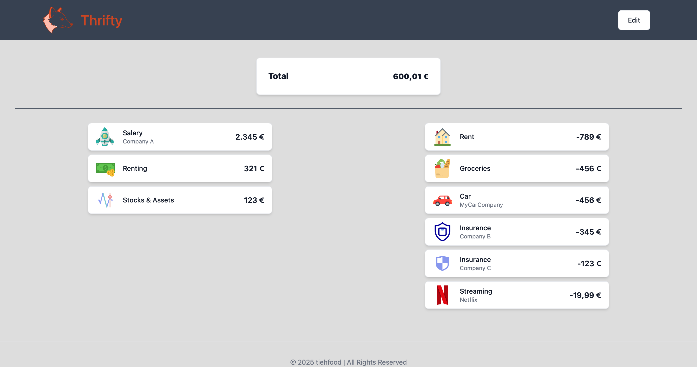

<p align="center">
    
</p>

# Thrifty

Please be gracious with me, this is my first ever app 🙈.  Thrifty is a simple web application that helps you manage your income and expenses.
It's focused on simplicity and is not aimed to track every single penny you spend.
The idea is to get a rough overview of your monthly cash flow and what's left to spend.

Features:
- Add income and expenses
- Delete entries
- Support for SVG icons (default: )
- Two rows for income and expenses (collapse into single one on smaller devices)

Frameworks used:

- __UI__: SvelteKit and Flowbite
- __API__: golang

## Screenshot


## Running the app

I currently don't publish dedicated releases, but you can run the app via docker compose.
It is then automatically built and started.

```bash
# create docker containers
docker compose -f docker-compose.yml build

# run the app
docker compose -f docker-compose.yml up -d
```
The app should now be available at `http://localhost:9090`.

### Tips
#### Want to use `$` as the currency symbol?
>Change `currency: 'EUR'` to `currency: 'USD'` in [+page.svelte](ui/src/routes/+page.svelte) and start the app like mentioned above.


## Developing

### Frontend
Install node and node modules.
Running locally requires you to change the API URL in [+page.svelte](ui/src/routes/+page.svelte).
Prepend the URL paths in the fetch calls with `http://localhost:8080/`.
```bash
cd ui

# install dependencies
pnpm i

# run ui
pnpm dev
```
You could also use regular npm instead of pnpm.
### Backend
Install golang and run the following commands.
```bash
cd api

# install dependencies
go get .

# run api
go run .
```

## Credits
- [NumberFlow](https://number-flow.barvian.me/svelte)