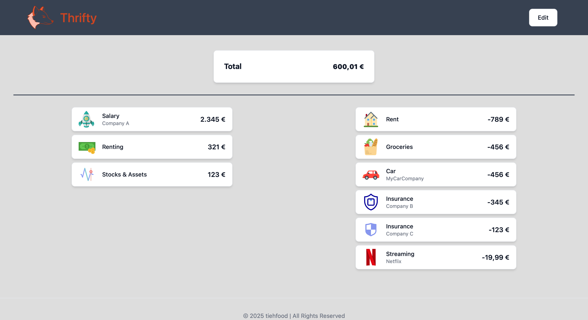
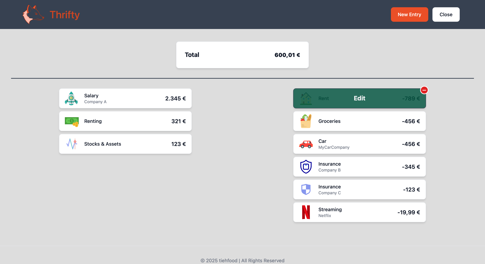

<p align="center">
    
</p>
<p align="center">
  <a href="https://github.com/tiehfood/thrifty/releases/latest">
    
  </a>
  <a href="https://hub.docker.com/r/tiehfood/thrifty-ui">
    
  </a>
  <a href="LICENSE">
    
  </a>
  <a href="https://github.com/tiehfood/thrifty">
    
  </a>
</p>

# Thrifty

Please be gracious with me, this is my first ever app 🙈.  Thrifty is a simple web application that helps you manage your income and expenses.
It's focused on simplicity and is not aimed to track every single penny you spend.
The idea is to get a rough overview of your monthly cash flow and what's left to spend.

Features:
- Add income and expenses
- Edit existing entries
- Delete entries
- Support for SVG icons (default: )
- Two rows for income and expenses (collapse into single one on smaller devices)
- API documentation at `/swagger/index.html`
- Currency configurable via environment variable

Frameworks used:

- __UI__: SvelteKit and Flowbite
- __API__: golang

## Screenshots
|  |  |
|:------------------------------------:|:------------------------------------:|
|  |  |

## Running the app

Every release since 1.2.0 should create a docker image on DockerHub.
Use [docker-compose.yaml](docker-compose.yaml) to run the app with the latest version.

```bash
# run the app
docker compose -f docker-compose.yaml up -d
```
The app should now be available at `http://localhost:9090`.

If you want to build the image yourself, you can use the following commands.
```bash
# run the app
docker compose -f docker-compose-build.yaml build

# run the app
docker compose -f docker-compose-build.yaml up -d
```

### Tips
#### Want to use `$` as the currency symbol?
>Set `CURRENCY_ISO=USD` for the UI in the docker compose file and restart the UI container.
#### How about other currencies?
> The step above should apply for any other currency ISO-code in this list: [ISO 4217](https://de.wikipedia.org/wiki/ISO_4217)
#### Where is the data stored?
> The data is stored in a SQLite database in a docker volume. You can also use a custom path in the [docker-compose.yaml](docker-compose.yaml) to expose the database.
#### I need a docker image for a different architecture.
> Currently amd64 and arm64 builds are created. For other architectures you can build the image yourself like described above.
#### Want to use the app without a reverse proxy?
> The default internal port for both containers is port 8080.
> If you want to use docker compose and just want to change the external port of the API container, you could add the environment variable `LOCAL_API_PORT=8080` to the UI container.
> Change it to the desired external port of your docker compose file.

> If you want to use the containers for example in host network mode, you could also change the port the API is listening on.
> Set the variable `PORT=8081` on the API container to change the internal port to 8081.
> Depending on your setup you might need to set `LOCAL_API_PORT` to the same value.

> You can also set `LOACL_API_HOSTNAME` and `LOCAL_API_PROTOCOL` if needed.
#### Want to have a single column all the time?
> Set the variable `USE_SINGLE_COLUMN=true` in the UI container to always use a single column layout.

## Developing

### Frontend
Install node and node modules.
Running locally requires you to change the API URL in [+page.svelte](ui/src/routes/+page.svelte).
Change `currentProtocol`, `currentHostname` and `currentPort` in the _onMount_ method to where your API development is running on.
```bash
cd ui

# install dependencies
pnpm i

# run ui
pnpm dev
```
You could also use regular npm instead of pnpm.
### Backend
Install golang and run the following commands.
```bash
cd api

# install dependencies
go get .

# install swag (optional)
go install github.com/swaggo/swag/cmd/swag@latest

# generate swagger documentation (optional)
swag init

# run api
go run .
```

## Credits
- [NumberFlow](https://number-flow.barvian.me/svelte)
- [Swag](https://github.com/swaggo/swag)